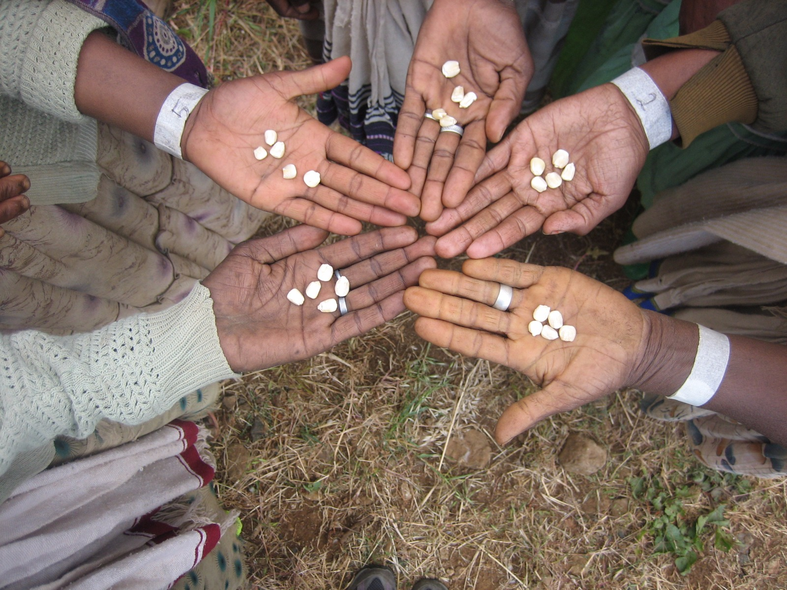

# agriLOWE
This repository contains all the features and instructions necessary to reproduce the agriLOWE ABM model. The model encompasses a spatial-based economy with an ecology of N farmers and 3 different types of land. Technological progress as well as shocks deriving from the interactions with the climate are modelled. 

The simulation aims at addressing these two open issues: is it possible to assess the climate change impacts to the agricultural sector in different technologically – developed countries, utilizing a global model? Further, is low technological change in the agricultural sector a bottleneck for development and climate change mitigation?

# Model's main components
1. Ecology of `N` farmers (no exit & no entry); 
2. 3 types of land: forestry, low-yield land (characterized by low fertility and intrinsic low productivity of the land) and high-yield land (where the fertility of the ground and the related productivity are instead higher);
3. `Production = min {alphaL, gammaS, thetaK}` with
    * `alpha`: productivity of labour embodied in the machines;
    * `gamma`: productivity of land;
    * `theta`: productivity of capital; 
4. Each farmer produce an homogenous bundle of food and the market is perfectly competitive;
5. Demand is increasing at a fix rate over time: `D=D(t-)(1+*d*)`
6. Labour force is equally distributed among cells : `l(t)=L/(xy-f)` with `f` forestry cells 
7. Cost structure is marginalist: `C(it)= w/alpha + p_land/gamma`
8. Technological progress depends on R&D internal and R&D external
9. `Profit = ((p_food - UC(it))sales(it))) - R&Dint - R&Dext`

# Climate Interactions

1. Damage function: Nordhaus (2017, Weitzman (2009)
2. Carbon uptake: Sterman et al. (2012) and IIASA's Global Biosphere Management Model (GLOBIOM)

# Model's Feature
*Code Language* : R, C++ (under development)

*Compile* : R no need, C++ uses CMake

*Inputs*: 21 + a spatial matrix

*Outputs*: 14 time series of interest

# Code structure

1. Data: import parameter set; 
2. Declare
3. Initialize
4. **while** t<T **do**:
    * New machines are produced
    * Receive food demand
    * Order new machineries
    * Perform internal R&D
    * Produce
    * Sell and compute profits
    * Obtain new machinery

**end**

# Requirements

agriLOWE has no system specific requirements. It is designed to minimize the level of constraints.
